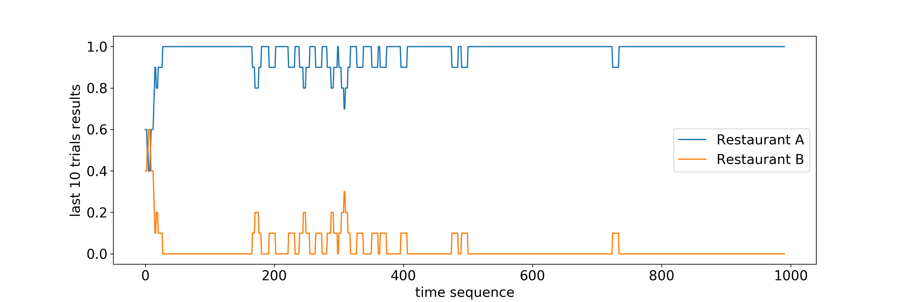
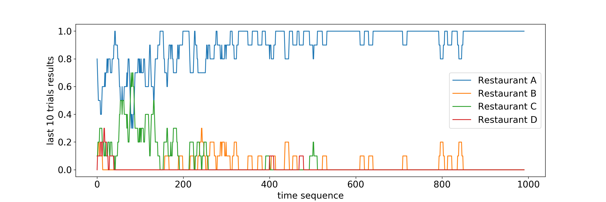

# Multi-arm Bandit problem

Multi-arm bandit is a colorful name for a problem we daily face in our lives given choices. The problem is how to choose given multitude of options. Lets make the problem concrete. Assume that its Friday evening and you are planning to go to a fancy restaurant. Should you try your favorite restaurant or try some new restaurant. If you go for your favorite restaurant then you are `exploiting` your past knowledge and if you go for a new  restaurant, then you are `exploring` which may be useful in future to find a better restaurant than your present restaurant. Unfortunately, it is also possible that you may come across some very bad restaurants during this exploration. The main question is how to balance the tradeoff between exploration and exploitation. `Thompson Sampling` essentially provides a way to solve this problem.

# Thompson Sampling

Assume that there are two restaurants $$A$$ and $$B$$. Assume that restaurant $$A$$ on an average $$\theta_1$$ times align to your taste and restaurant $$B$$ on an average $$\theta_2$$ times align to your taste. In other words, if you go to restaurant $$A$$, $$N$$ times, then you will like the experience $$\theta_1 N$$ times and if you go to restaurants $$B$$, $$N$$ times, then you will like the experience $$\theta_2 N$$ times where $$\theta_1$$ and $$\theta_2$$ are some numbers between $$0$$ and $$1$$. Unfortunately these numbers $$\theta_1$$ and $$\theta_2$$ are unknown to you so you cannot know which restaurant you should choose. You go to restaurant very often and you want to maximize your chances of having good experiences in the restaurants during your life time. How should you choose these restaurants based on your experiences so far? Thompson Sampling comes to rescue here.

The idea behind Thompson Sampling is inspired by Bayesian Inference. Lets try to present the main idea behind Thompson Sampling as succinctly as possible below:

1. Lets assume that we have priors on unknown parameters that affects the reward for our bandit problem. In our restaurant example, the parameters are $$\theta_1$$ and $$\theta_2$$. The reward for bandit problem is essentially $$\theta_1$$ and $$\theta_2$$ which are the measure of goodness of the restaurant.
2. We sample a value of unknown parameters from this prior distribution.
3. We compute the reward from these sampled parameters.
4. We choose the actions which gives the highest reward.
5. We observe the actual reward gathered by taking our action.
6. We update the priors on the parameters using the observed reward.
7. We repeat the above procedure using the new posterior distribution.

# Thompson Sampling in action

Now lets apply the Thompson Sampling to our restaurant hunting problem and see how does it help us in resolving the problem.
1. Since we don't know anything about the restaurants initially, we can assume that the $$\theta_1$$ and $$\theta_2$$ parameters are uniformly distributed between $$0$$ and $$1$$. Note that we can also write a uniform distribution between $$0$$ and $$1$$ as a beta-distribution $$B(1, 1)$$. Please read more about the beta-distribution [here](https://en.wikipedia.org/wiki/Beta_distribution) which is going to be helpful in understanding the upcoming text.

2. We sample a value for $$\theta_1$$ and a value for $$\theta_2$$ from their prior distribution. We choose the restaurant having the higher $$\theta$$ values.

3. Assume that you chose the restaurant $$A$$ in the previous step. You go to the restaurant and if you have the good experience in the restaurant, you give it $$+1$$ reward otherwise you would give it a $$0$$ reward.

4. Now we need to update the distribution for $$\theta_1$$ based on the reward that we observed in the previous step. Since our prior distribution was the beta-distribution, it is easy to do as described below:
> If your prior distribution for $$\theta_1$$ is $$B(\alpha, \beta)$$ you receive the reward $$r$$ for going to restaurant $$A$$ then the posterior probability distribution for $$\theta_1$$ is $$B(\alpha + r, \beta + (1 -r))$$.

5. Now to choose a restaurant second time, you sample new values for $$\theta_1$$ and $$\theta_2$$ but you use the updated probability distribution for the restaurant $$A$$ that was chosen in the first trial and you keep going on like that to choose restaurants.

Now lets see how does Thompson Sampling helps us in finding the best restaurant. We will simulate this behavior. For this simulation, we will assume that the true value of $$\theta_1$$ is $$0.9$$ and true value of $$\theta_2$$ is $$0.7$$. We would like to see that as time progress, Thompson Sampling would recommend us restaurant $$A$$ more and more.

In the following figure, we plot how Thompson sampling chooses between restaurant $$A$$ and restaurant $$B$$. Each point is telling us the fraction of time restaurant $$A$$ and restaurant $$B$$ were chosen by Thompson sampling in the previous $$10$$ trials. It is interesting to see that in this case Thompson sampling figures out pretty quickly (approximately $$10$$ trials) that it should stick with restaurant $$A$$ for better experience.    

It is interesting to note that Thompson Sampling is doing a good job in finding the best restaurant when we have to find the best restaurants only among two restaurants. An obvious question comes,  is  Thompson Sampling easily extendable. In other words, can it gives us a similar performance when we had to find the best restaurant among $$N$$ restaurants where $$N > 2$$. To investigate this question, we did a simulation as you can see in the following figure.  

For the above simulation, we assume that the true thetas parameter of Thompson Sampling are $$0.95, 0.9, 0.85$$ and $$0.8$$ for restaurant A, B, C, and D respectively. As you can see in the above figure, Thompson Sampling is able to recommend the best restaurant $$A$$ consistently although it is taking approximately $$200$$ trials for Thompson Sampling to consistently make this claim.

At this juncture of this blog, we can ask some important questions as following:

1. Can we change Thompson Sampling somehow to increase the convergence speed of Thompson Sampling?
2. Can we utilize some side information (such as recipe of the restaurants, information about chefs etc) to decrease the learning time for Thompson Sampling?

Contextual Thompson Sampling is precisely the answer of the above questions that will be the focus of the rest of the blog.

# Contextual Thompson Sampling

Following the previous case (Simple Thompson Sampling), we will first use a mathematical abstraction to explain Contextual Thompson Sampling. Further, we will elaborate this concept with the help of our ongoing restaurant search problem.  
