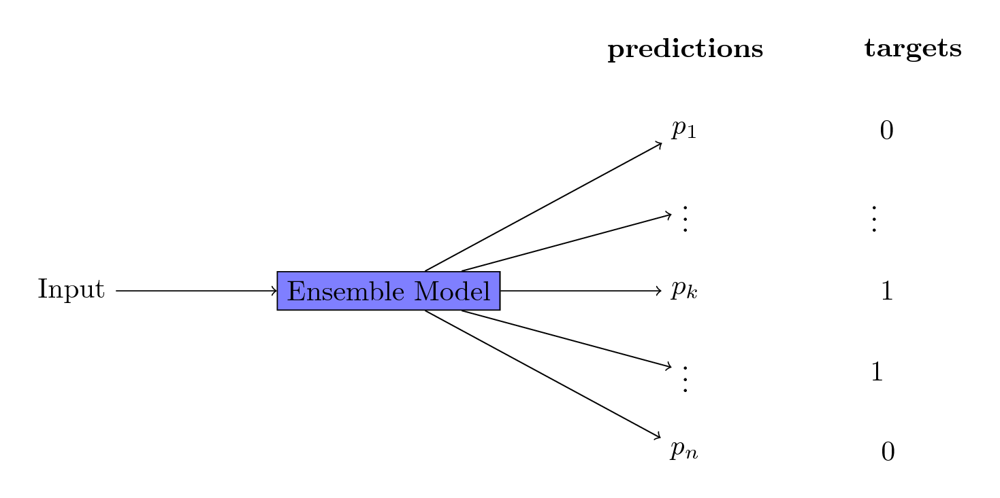
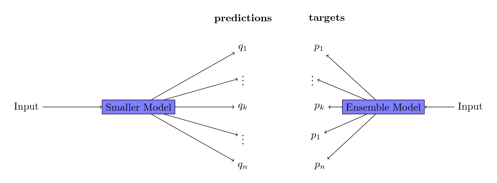
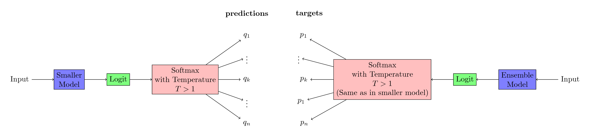
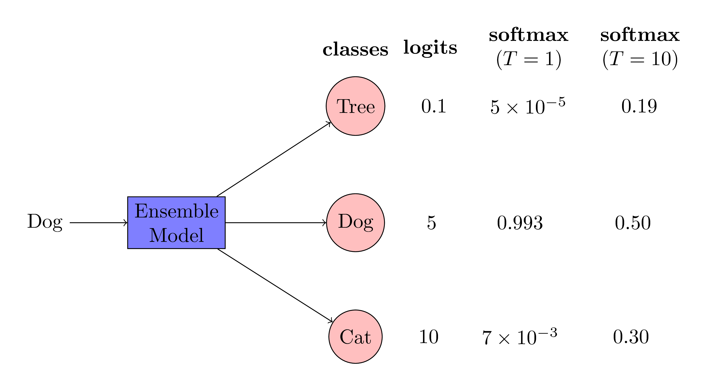

# Goal

[code](https://github.com/abhishm/dark_knowledge)

It is a common trend in machine learning competitions to train many models and then combine these models using an ensemble approach. This model could be very big and can cause inference to be very slow. Can we somehow transfer all the knowledge learned by this big model to a smaller network? The answer to this question is yes. In this post, we will learn about the [work](https://arxiv.org/abs/1503.02531) of [Geoffrey Hinton](https://en.wikipedia.org/wiki/Geoffrey_Hinton) where he distills the knowledge of a big cumbersome neural network into a smaller and more manageable network.

# How do we transfer the knowledge of the ensemble model to a smaller network?

**The trick is to train the smaller model on the probabilities of the ensemble model**. Assume that you have a big ensemble model as shown below.

If it is a classification problem, your targets are usually one-hot representation of labels. To train a smaller network that performs as good as the ensemble network, we need to train the smaller network on the output of ensemble. The following figure gives a demonstration of this training procedure.

The training procedure for the smaller network consists of two steps:
1. Train on the probabilities of ensemble model with a high temperature $$T$$ as shown in the following figure.

A natural question comes is why are we using a high temperature for getting the probabilities? The answer lies in the fact that the relative probabilities between classes contains useful information for training. However, these relative probabilities are highly skewed. A high temperature helps in reflecting these relative probabilities more prominently. To understand it, consider the following example:

As you can see in the above figure, we are trying to infer the class type of an image by the ensemble model. The input to the ensemble model is an image of a dog. The ensemble model correctly gives high logit values for the class *dog* and low logit values for the class *cat* and the class *tree*. Moreover, there is lot of information in the logit values of other classes. The logit values of *cat* is higher than the logit values of *tree*. This implies that the ensemble model is more likely confuse a dog with a cat than a tree. This is a valuable information and this information is utilized by the distilling trick of Geoffrey Hinton. Note that, when we apply the softmax operation on these logit values, we get very low probabilities for classes   cat and tree. These probabilities are so small that their contribution into the loss function is negligible. Therefore, we increase the temperature of the softmax operation to make the probabilities of other classes higher to have them a significant contribution into the loss function.

2. Also use the actual targets to update the smaller model. This is an empirical choice. The authors find that using hard targets along with the soft targets helps in getting better results.  

# Experiment

## Data

I am using MNIST data. The MNIST data consists of images of digit between $$0$$ and $$9$$. There are $$60000$$ training data and $$10000$$ testing data.

## Methodology

1. I train a big neural network (two hidden units each having 1200 neurons) with [dropout](https://arxiv.org/pdf/1207.0580.pdf).
2. Dropout is another way of creating an ensemble model.
3. I followed all the tricks mentioned in the paper to get the same exact numbers mentioned in the [paper]((https://arxiv.org/abs/1503.02531)). You can find the details of my work [here](https://github.com/abhishm/dark_knowledge).
4. I train a small neural network model (two hidden units each having 800 neurons) without any regularization.
5. I show that this small neural network trained with class labels get low accuracy.
6. I show that when this small neural network is trained with soft targets (probabilities generated by the ensemble network), it achieves the better accuracy.
## Results
1. The ensemble network misclassified $$101$$ examples.
2. The small network with hard-update (using the labels) misclassified $$196$$ examples.
3. The distilled network misclassified $$137$$ examples.

## Observations:
1. The distill network does not require any regularization. Probabilities from the ensemble network in itself is a very good regularizer.
2. The small network with hard update require early-stopping to stop the deterioration of the accuracy.
